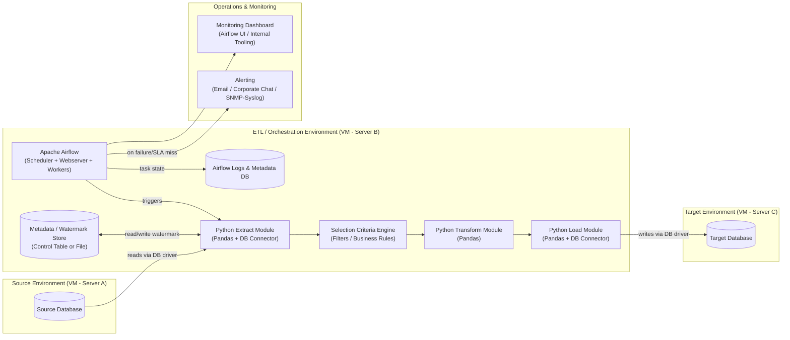
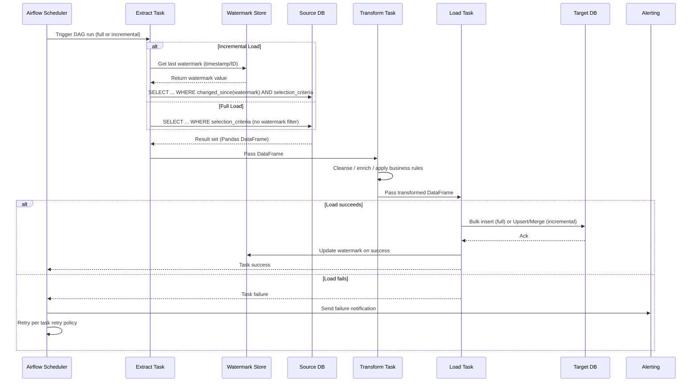
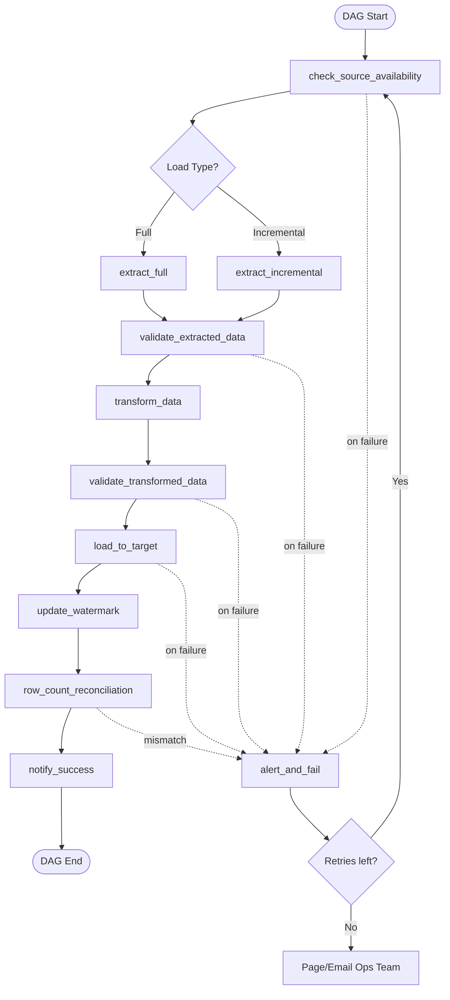
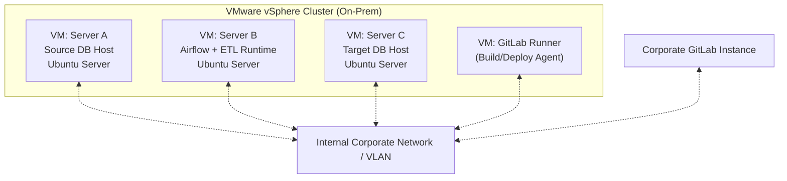

# High-Level Architecture Document
## Source-to-Target Data Pipeline (Extract, Transform & Load)

**Document Version:** 1.0
**Status:** Draft
**Environment:** On-Premise (VMware Virtualized Infrastructure)

---

## 1. Overview

This document describes the high-level architecture for a data pipeline that extracts data from a source system database, applies selection/filtering criteria, transforms the data, and loads it into a target system database residing on a separate server. The pipeline runs entirely within an on-premise corporate network on VMware virtual machines — no public cloud or container runtime is used.

**Key characteristics:**

| Aspect | Choice |
|---|---|
| Compute layer | VMware vSphere Virtual Machines (on-prem) |
| Source control / CI-CD | GitLab (self-hosted or corporate instance) |
| Extract / Transform / Load language | Python + Pandas |
| Orchestration | Apache Airflow |
| Load modes | Full load and Incremental load |
| Reliability | Task-level restart/retry, alerting on failure |
| Deployment model | Native OS processes / Python virtual environments on VMs (no Docker) |
| Operating System | Ubuntu Server (Linux VMs) |

---

## 2. Architecture Goals

1. Reliable, repeatable movement of data from a source DB to a target DB across servers.
2. Configurable data selection criteria (filters, date ranges, business rules) applied at extraction time.
3. Support both **full refresh** and **incremental (delta)** load patterns.
4. Centralized orchestration, scheduling, monitoring, and alerting via Apache Airflow.
5. Automatic and manual **restart/retry** capability at the task and DAG level.
6. Fit within existing corporate infrastructure — VMware VMs, internal network, GitLab CI/CD — with no dependency on containers or public cloud services.

---

## 3. High-Level Architecture Diagram



---

## 4. Component Breakdown

### 4.1 Source Environment (Server A)
- Hosts the **source database** (relational DB, e.g., Oracle/SQL Server/PostgreSQL — network-reachable only from within the corporate network).
- Exposes a read-only service account for extraction, scoped to the required schemas/tables.
- No changes required to source system beyond DB connectivity/firewall rules and a read-only credential.

### 4.2 ETL / Orchestration Environment (Server B)
This VM hosts the pipeline logic and Airflow itself, deployed as native Ubuntu services (systemd-managed), running inside Python virtual environments — **no containers**.

- **Apache Airflow**
  - Scheduler, Webserver, and Worker processes (LocalExecutor or CeleryExecutor across multiple VMs if horizontal scaling is needed).
  - Airflow's own metadata DB (PostgreSQL) stores DAG run history, task state, and logs.
- **Python Extract Module**
  - Uses SQLAlchemy/pyodbc/cx_Oracle (per source DB type) plus Pandas to pull data.
  - Applies **selection criteria** (date windows, status flags, business filters) via parameterized SQL pushed down to the source, minimizing data pulled over the network.
- **Selection Criteria Engine**
  - Centralized, config-driven (YAML/JSON or Airflow Variables) rule set defining what "in scope" data looks like per table/entity.
  - Same config drives both full and incremental extraction logic.
- **Python Transform Module**
  - Pandas-based cleansing, type conversion, joins/enrichment, and business rule application.
- **Python Load Module**
  - Writes transformed DataFrames to the target DB (bulk insert / upsert via SQLAlchemy or native bulk-load utility).
  - Supports truncate-and-load (full) or merge/upsert (incremental).
- **Metadata / Watermark Store**
  - A lightweight control table (in Airflow's metadata DB or a small dedicated schema) tracking last successful extraction timestamp/ID per table — the basis for incremental loads.

### 4.3 Target Environment (Server C)
- Hosts the **target database**, physically/logically separate from the source server.
- Receives data over the internal network via the Load module's DB connection.

### 4.4 Operations & Monitoring
- **Alerting:** Airflow `on_failure_callback` / SLA-miss callbacks route to corporate email distribution lists and/or an internal chat/webhook integration (e.g., Mattermost, Teams via internal relay) — no external SaaS dependency.
- **Monitoring:** Airflow's built-in UI for DAG/task status; optionally forwarded to an internal monitoring stack (e.g., Nagios/Zabbix/Prometheus if already used corporately) via log shipping.

---

## 5. Data Flow Diagram (Full vs. Incremental)



---

## 6. Apache Airflow DAG Design



**Design notes:**
- Each task uses Airflow's native `retries`, `retry_delay`, and `retry_exponential_backoff` settings for automatic transient-failure recovery.
- `row_count_reconciliation` compares source-extracted vs. target-loaded row counts (and optionally checksums) before marking the run successful.
- Failed DAG runs are **safely re-runnable**: extract/load tasks are idempotent (truncate-and-load for full; upsert-by-key for incremental), so a manual "Clear Task"/rerun in Airflow will not duplicate data.
- The watermark update is the **last** step in the happy path, ensuring a failed run never advances the incremental marker — a rerun will always pick up the correct delta window.

---

## 7. Restart & Recovery Strategy

| Failure Scenario | Recovery Mechanism |
|---|---|
| Transient network/DB timeout | Airflow task-level automatic retry with exponential backoff |
| Task fails after N retries | DAG marked failed; alert fired; task can be manually cleared/rerun from Airflow UI once root cause resolved |
| Partial load (crash mid-write) | Load uses transactional batches; target table state validated by reconciliation task before watermark commit — reruns are idempotent |
| Full VM/server outage | Airflow scheduler/metadata DB backed by scheduled VM snapshots and DB backups; DAG state recoverable on VM restore |
| Wrong data loaded (business issue) | Full load can be re-triggered on demand; incremental watermark can be manually reset via control table to reprocess a date range |

---

## 8. Alerting

- **Channels:** Corporate email distribution list (primary); internal chat webhook (secondary), both reachable without leaving the corporate network.
- **Triggers:**
  - Task failure (after retries exhausted)
  - DAG SLA miss (run exceeds expected duration)
  - Row-count/reconciliation mismatch between source and target
  - Source or target DB unreachable at `check_source_availability`
- **Airflow features used:** `on_failure_callback`, `sla_miss_callback`, and Airflow's built-in email operator/SMTP integration (corporate mail relay).

---

## 9. Deployment & CI/CD (GitLab)

```mermaid
flowchart LR
    DEV[Developer Workstation\nVS Code + GitBash] -->|git push| REPO[GitLab Repository]
    REPO --> PIPE[GitLab CI/CD Pipeline]
    PIPE --> LINT[Lint & Unit Test\n(pytest, flake8)]
    LINT --> PKG[Build Python venv artifact /\nversioned deployment package]
    PKG --> DEPLOY_STG[Deploy to Staging VM\n(via GitLab Runner + Ansible/SSH)]
    DEPLOY_STG --> TEST_STG[Integration Test on Staging]
    TEST_STG -->|approved| DEPLOY_PRD[Deploy to Production VM\n(Server B)]
    DEPLOY_PRD --> AF2[Airflow picks up new DAG version]
```

**Notes:**
- Source control and CI/CD run entirely on the corporate GitLab instance — no external SaaS.
- GitLab Runners (installed on internal build VMs) execute lint/test/package stages and deploy via SSH/Ansible to the target VMware VMs — no Docker images involved; deployment is a versioned Python package/venv sync plus DAG file sync to Airflow's `dags/` folder.
- Manual approval gate before promotion from staging to production is recommended given the pipeline touches production databases.

---

## 10. Infrastructure Layout (VMware)



- All VMs sit on the internal corporate network/VLAN with firewall rules restricting DB ports (e.g., 1521/1433/5432) to only the ETL VM (Server B).
- Standard corporate patching, backup, and VM snapshot policies apply (no cloud-native backup services).

---

## 11. Non-Functional Considerations

| Concern | Approach |
|---|---|
| Security | Service accounts with least-privilege DB access; credentials stored in Airflow Connections (encrypted in Airflow metadata DB) rather than in code/config files |
| Scalability | Airflow CeleryExecutor with additional worker VMs if load volume grows; Pandas chunked reads (`chunksize`) for large tables to control memory footprint |
| Auditability | Every DAG run logged in Airflow metadata DB; row-count reconciliation results persisted for audit trail |
| Data volume limits | Pandas is in-memory — large tables should be chunked/batched; if volumes grow beyond what Pandas comfortably handles, revisit with a database-native bulk transfer approach |
| Environment parity | Same Python venv/requirements.txt used across dev, staging, and production VMs, version-pinned and rebuilt via GitLab CI/CD |

---

## 12. Open Items for Follow-Up

- Confirm source and target DB engines (Oracle, SQL Server, PostgreSQL, etc.) to finalize connector libraries.
- Confirm expected data volumes per run to validate Pandas in-memory approach vs. chunked/streaming processing.
- Confirm corporate alerting channel (email relay vs. internal chat webhook) and Airflow Executor choice (Local vs. Celery) based on available VM capacity.
- Confirm GitLab Runner placement (dedicated VM vs. shared build infrastructure).
