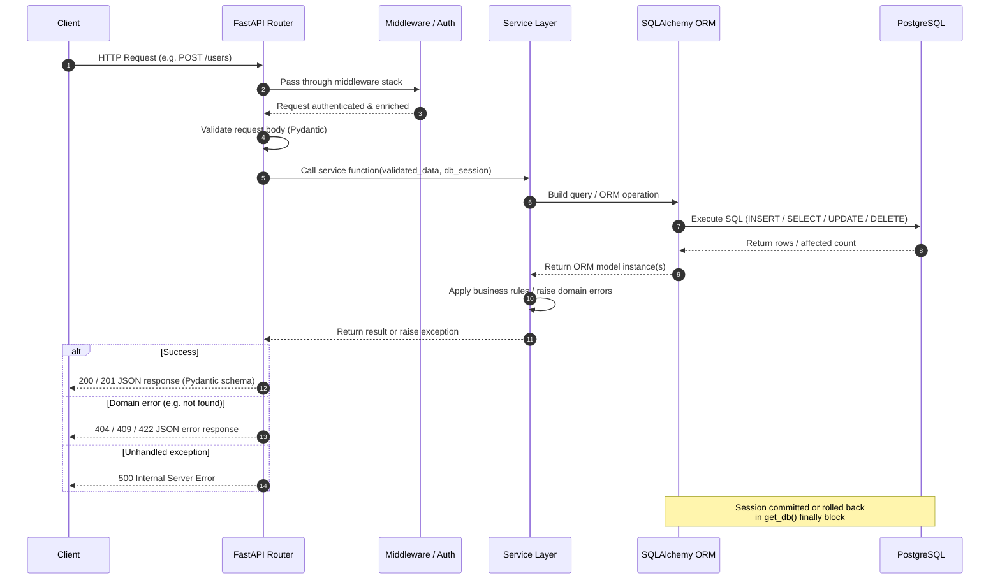

# Architecture Overview: FastAPI + PostgreSQL + Docker

This document describes the architecture of the backend service, which is built on **FastAPI** (Python), backed by a **PostgreSQL** relational database, and containerised with **Docker Compose**. It covers the major components, how they connect, the request lifecycle, and deployment configuration.

---

## Table of Contents

1. [High-Level Overview](#1-high-level-overview)
2. [Key Components](#2-key-components)
   - [API Layer — FastAPI](#21-api-layer--fastapi)
   - [Business Logic / Service Layer](#22-business-logic--service-layer)
   - [Database Layer — SQLAlchemy + PostgreSQL](#23-database-layer--sqlalchemy--postgresql)
   - [Containerisation — Docker & Docker Compose](#24-containerisation--docker--docker-compose)
3. [Request Lifecycle](#3-request-lifecycle)
4. [Sequence Diagram](#4-sequence-diagram)
5. [Docker Compose Setup](#5-docker-compose-setup)
6. [Environment Variables & Configuration](#6-environment-variables--configuration)
7. [How the Layers Connect](#7-how-the-layers-connect)

---

## 1. High-Level Overview

```
┌─────────────────────────────────────────────────────────┐
│                     Docker Network                      │
│                                                         │
│   ┌──────────────────┐       ┌──────────────────────┐  │
│   │   api (FastAPI)  │──────▶│   db (PostgreSQL 15) │  │
│   │   Port 8000      │       │   Port 5432           │  │
│   └──────────────────┘       └──────────────────────┘  │
│           ▲                                             │
└───────────┼─────────────────────────────────────────────┘
            │
        Client / Browser / CLI
```

The service follows a classic **three-tier architecture**:

| Tier | Technology | Responsibility |
|------|-----------|----------------|
| Presentation / API | FastAPI + Uvicorn | HTTP routing, request validation, response serialisation |
| Business Logic | Python service modules | Domain rules, orchestration, error handling |
| Data | SQLAlchemy ORM + PostgreSQL | Persistent storage, transactions, query execution |

All tiers are packaged as Docker containers and wired together with Docker Compose, so the entire stack spins up with a single `docker compose up` command.

---

## 2. Key Components

### 2.1 API Layer — FastAPI

FastAPI is an ASGI framework that handles inbound HTTP requests. It provides:

- **Routers** (`APIRouter`) — group related endpoints by domain (e.g., `/users`, `/items`). Each router file lives under `app/routers/`.
- **Pydantic schemas** — request body and response models are declared as `BaseModel` subclasses under `app/schemas/`. FastAPI uses these to validate incoming JSON and serialise outgoing responses automatically.
- **Dependency Injection** — FastAPI's `Depends()` system injects shared resources (database sessions, authenticated users, config) into route handlers without boilerplate.
- **OpenAPI docs** — automatically generated at `/docs` (Swagger UI) and `/redoc`.
- **Uvicorn** — the ASGI server that runs FastAPI inside the container. In production, Gunicorn manages multiple Uvicorn worker processes.

**Typical project layout:**

```
app/
├── main.py            # Application factory, router registration, lifespan hooks
├── routers/
│   ├── users.py
│   └── items.py
├── schemas/
│   ├── user.py
│   └── item.py
├── services/
│   ├── user_service.py
│   └── item_service.py
├── models/
│   ├── base.py        # DeclarativeBase
│   ├── user.py
│   └── item.py
├── db/
│   ├── session.py     # Engine + SessionLocal factory
│   └── dependencies.py  # get_db() dependency
└── core/
    └── config.py      # Settings via pydantic-settings
```

### 2.2 Business Logic / Service Layer

Route handlers are kept thin — they validate input, call into a **service function**, and return the result. Service modules under `app/services/` contain:

- **CRUD operations** — create, read, update, delete records via the ORM.
- **Domain logic** — e.g. checking uniqueness constraints, applying business rules, composing multiple ORM queries into a single atomic transaction.
- **Exception handling** — service functions raise domain-specific exceptions (`ItemNotFound`, `DuplicateEmail`) that route handlers catch and map to HTTP responses (404, 409, etc.).

This separation means business logic can be unit-tested independently of HTTP concerns.

### 2.3 Database Layer — SQLAlchemy + PostgreSQL

**SQLAlchemy (2.x)** is the ORM that bridges Python objects and the PostgreSQL database.

- **Engine** — created once at startup from the `DATABASE_URL` environment variable. Manages the connection pool (default: `pool_size=5`, `max_overflow=10`).
- **Session** — a `Session` object represents a unit of work. It is opened per-request via the `get_db()` dependency and closed (committed or rolled back) when the request finishes.
- **Models** — Python classes that inherit from `DeclarativeBase` map directly to PostgreSQL tables. Relationships are expressed with `relationship()` and foreign keys.
- **Alembic** — handles schema migrations. Migration scripts live in `alembic/versions/` and are applied with `alembic upgrade head`, typically run as an init container or entrypoint step before the API starts.

**PostgreSQL** provides:
- ACID transactions.
- JSON/JSONB columns for semi-structured data.
- Full-text search via `tsvector`.
- Row-level security if multi-tenancy is required.

### 2.4 Containerisation — Docker & Docker Compose

Each service runs in its own container:

| Container | Base Image | Purpose |
|-----------|-----------|---------|
| `api` | `python:3.12-slim` | Runs Uvicorn + FastAPI |
| `db` | `postgres:15-alpine` | PostgreSQL data store |

The `api` image is built from a multi-stage `Dockerfile`:

```dockerfile
# Stage 1: build dependencies
FROM python:3.12-slim AS builder
WORKDIR /build
COPY requirements.txt .
RUN pip install --prefix=/install --no-cache-dir -r requirements.txt

# Stage 2: runtime image
FROM python:3.12-slim
WORKDIR /app
COPY --from=builder /install /usr/local
COPY . .
EXPOSE 8000
CMD ["uvicorn", "app.main:app", "--host", "0.0.0.0", "--port", "8000"]
```

Multi-stage builds keep the final image small by excluding build tooling.

---

## 3. Request Lifecycle

A complete HTTP request flows through the following stages:

1. **Client** sends an HTTP request (e.g. `POST /users`).
2. **Uvicorn** (ASGI server) receives the raw TCP connection and parses the HTTP request.
3. **FastAPI middleware stack** processes the request — CORS headers, logging, authentication middleware run in order.
4. **Router** matches the URL path and HTTP method to a route handler function.
5. **Dependency injection** resolves `Depends()` — the database session (`get_db`) and any auth dependencies are executed and injected.
6. **Pydantic validation** — the request body is parsed and validated against the schema. A 422 is returned automatically if validation fails.
7. **Route handler** calls into the **service layer** with validated data.
8. **Service layer** executes business logic and interacts with the ORM.
9. **SQLAlchemy** translates ORM operations into SQL statements and executes them against PostgreSQL via the connection pool.
10. **PostgreSQL** executes the query and returns rows.
11. **SQLAlchemy** maps rows back to Python model instances.
12. **Service layer** returns the result to the route handler.
13. **Route handler** returns a Pydantic response schema — FastAPI serialises it to JSON.
14. **Uvicorn** sends the HTTP response to the client.
15. **Session cleanup** — the `get_db()` dependency's `finally` block commits or rolls back and closes the session.

---

## 4. Sequence Diagram



---

## 5. Docker Compose Setup

```yaml
# docker-compose.yml
version: "3.9"

services:
  db:
    image: postgres:15-alpine
    restart: unless-stopped
    environment:
      POSTGRES_USER: ${POSTGRES_USER}
      POSTGRES_PASSWORD: ${POSTGRES_PASSWORD}
      POSTGRES_DB: ${POSTGRES_DB}
    volumes:
      - postgres_data:/var/lib/postgresql/data
    ports:
      - "5432:5432"          # expose locally for dev tooling; remove in prod
    healthcheck:
      test: ["CMD-SHELL", "pg_isready -U ${POSTGRES_USER} -d ${POSTGRES_DB}"]
      interval: 10s
      timeout: 5s
      retries: 5

  api:
    build:
      context: .
      dockerfile: Dockerfile
    restart: unless-stopped
    depends_on:
      db:
        condition: service_healthy   # wait for PostgreSQL to be ready
    environment:
      DATABASE_URL: postgresql+psycopg2://${POSTGRES_USER}:${POSTGRES_PASSWORD}@db:5432/${POSTGRES_DB}
      SECRET_KEY: ${SECRET_KEY}
      ENV: ${ENV:-development}
    ports:
      - "8000:8000"
    volumes:
      - .:/app                       # hot-reload in development; remove in prod

volumes:
  postgres_data:
```

Key design decisions in this Compose file:

- **`depends_on` with healthcheck** — the `api` service waits until PostgreSQL passes its `pg_isready` probe before starting. This prevents connection errors during startup.
- **Named volume** (`postgres_data`) — database files persist across `docker compose down` cycles. Use `docker compose down -v` to wipe them.
- **Service hostname** — inside the Docker network, the API container reaches the database at the hostname `db` (the service name), on port `5432`.
- **Environment variable substitution** — sensitive values are never hardcoded in `docker-compose.yml`; they are supplied via a `.env` file (see below).

### Running the stack

```bash
# Start everything (build if needed)
docker compose up --build

# Run in background
docker compose up -d

# Apply database migrations
docker compose exec api alembic upgrade head

# Tail logs
docker compose logs -f api

# Tear down (keep data)
docker compose down

# Tear down and wipe database
docker compose down -v
```

---

## 6. Environment Variables & Configuration

All configuration is loaded from environment variables, following the [12-Factor App](https://12factor.net/config) methodology. In development, a `.env` file is loaded by Docker Compose.

### `.env` (never commit this file)

```dotenv
# PostgreSQL
POSTGRES_USER=appuser
POSTGRES_PASSWORD=supersecretpassword
POSTGRES_DB=appdb

# SQLAlchemy connection string (constructed from the above in compose)
DATABASE_URL=postgresql+psycopg2://appuser:supersecretpassword@db:5432/appdb

# Application
SECRET_KEY=changeme-use-openssl-rand-hex-32
ENV=development        # development | production
LOG_LEVEL=info
ALLOWED_ORIGINS=http://localhost:3000
```

### `app/core/config.py`

```python
from pydantic_settings import BaseSettings, SettingsConfigDict

class Settings(BaseSettings):
    model_config = SettingsConfigDict(env_file=".env", env_file_encoding="utf-8")

    database_url: str
    secret_key: str
    env: str = "development"
    log_level: str = "info"
    allowed_origins: list[str] = ["*"]

settings = Settings()
```

`pydantic-settings` reads values from environment variables (and optionally a `.env` file) and validates types at startup. If a required variable is missing, the application fails fast with a descriptive error — before accepting any requests.

### Security notes

- `.env` must be in `.gitignore`.
- In production (AWS ECS, EKS, etc.), inject secrets via AWS Secrets Manager or Parameter Store rather than a `.env` file.
- Rotate `SECRET_KEY` and `POSTGRES_PASSWORD` regularly.

---

## 7. How the Layers Connect

```
┌──────────────────────────────────────────────────────┐
│  app/main.py                                         │
│  • Creates FastAPI app instance                      │
│  • Registers routers (include_router)                │
│  • Registers lifespan hook (startup / shutdown)      │
└─────────────────────┬────────────────────────────────┘
                      │ imports
          ┌───────────▼───────────┐
          │  app/routers/*.py     │
          │  • Path operations    │
          │  • Pydantic schemas   │
          │  • Depends(get_db)    │
          └───────────┬───────────┘
                      │ calls
          ┌───────────▼───────────┐
          │  app/services/*.py    │
          │  • Business logic     │
          │  • ORM interactions   │
          │  • Error handling     │
          └───────────┬───────────┘
                      │ uses
          ┌───────────▼───────────┐
          │  app/models/*.py      │
          │  SQLAlchemy models    │
          │  (map to PG tables)   │
          └───────────┬───────────┘
                      │ SQL over TCP
          ┌───────────▼───────────┐
          │  PostgreSQL (db svc)  │
          │  Port 5432            │
          └───────────────────────┘
```

**Connection flow summary:**

- `main.py` wires routers into the app and sets up the SQLAlchemy engine on startup.
- Routers declare endpoints and use `Depends(get_db)` to receive a scoped database session per request.
- Service functions receive the session, build ORM queries using model classes, and return domain objects.
- SQLAlchemy translates ORM calls into parameterised SQL and sends them to PostgreSQL over the Docker internal network.
- Results travel back up the call stack and are serialised into JSON responses by FastAPI.

This clean separation of concerns means each layer can be tested, swapped, or scaled independently — for example, replacing PostgreSQL with a read replica for query-heavy endpoints, or adding a caching layer between the service and ORM without touching the API routes.

---

*Last updated: 2026-06-28*
