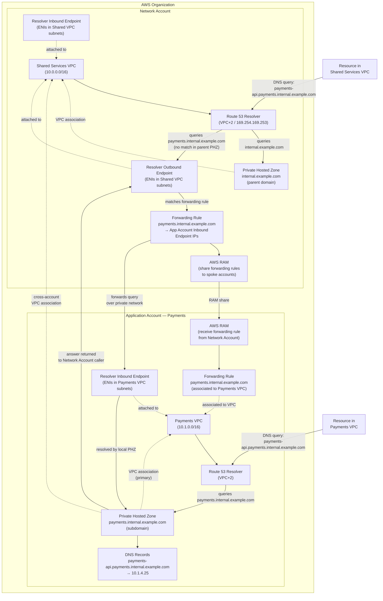

# Private Hosted Zone Architecture — AWS Multi-Account DNS

## Overview

In an AWS multi-account strategy, DNS is typically split across a **Network Account** (centrally managed parent domain) and individual **Application Accounts** (subdomains scoped to each workload). This document describes how private hosted zones (PHZs), VPC associations, Route 53 Resolver endpoints, and AWS RAM-shared forwarding rules work together to provide seamless private DNS resolution across account boundaries.

The architecture follows two complementary patterns:

- **Cross-account PHZ association** — the application account's PHZ for its subdomain is also associated with the network account's shared VPC, so central resolvers can answer for it.
- **Route 53 Resolver forwarding rules** — the network account's outbound resolver forwards subdomain queries to inbound resolver endpoints in each application account. Rules are shared to spoke accounts via AWS RAM.

---

## Domain Hierarchy Example

```
internal.example.com          ← Network Account (parent PHZ)
│
└── payments.internal.example.com   ← Application Account – Payments PHZ
└── orders.internal.example.com     ← Application Account – Orders PHZ
```

---

## Architecture Diagram



---

## Component Descriptions

### Network Account

**Private Hosted Zone — `internal.example.com`**
The parent domain PHZ is created in the Network Account and associated with the Shared Services VPC. It holds records for shared central services (e.g., `vpn.internal.example.com`, `ntp.internal.example.com`). It does not hold NS delegation records for subdomains — private hosted zones do not support NS-based subdomain delegation the same way public DNS does. Subdomain resolution is handled via Resolver forwarding rules instead.

**Route 53 Resolver Inbound Endpoint**
A set of ENIs deployed across two or more subnets in the Shared Services VPC. On-premises DNS servers or other external resolvers can forward queries to these IPs to resolve records in the Network Account's PHZs.

**Route 53 Resolver Outbound Endpoint**
A set of ENIs used as the source for forwarded DNS queries leaving the Network Account's VPC. When the VPC resolver cannot answer a query from its associated PHZs, a forwarding rule matching the queried domain sends the query out through this endpoint to the target resolver IP.

**Forwarding Rules**
Each application subdomain gets a forwarding rule pointing to the Inbound Endpoint IPs in the corresponding Application Account VPC. For example:

```
Domain:  payments.internal.example.com
Target:  10.1.2.10:53, 10.1.3.10:53   ← Inbound Endpoint ENI IPs in Payments VPC
```

Rules are shared to all relevant spoke accounts using **AWS Resource Access Manager (RAM)**.

---

### Application Account — Payments

**Private Hosted Zone — `payments.internal.example.com`**
Created in the Application Account. Holds all DNS records for the payments workload:

```
payments-api.payments.internal.example.com     A     10.1.4.25
payments-db.payments.internal.example.com      A     10.1.5.10
payments-cache.payments.internal.example.com   A     10.1.5.30
```

**VPC Association (Primary)**
The PHZ is directly associated with the Payments VPC. Resources in that VPC can resolve `*.payments.internal.example.com` immediately via the local VPC resolver (VPC+2).

**Cross-Account VPC Association**
The PHZ is additionally associated with the **Network Account's Shared Services VPC**. This is a two-step process:

1. The Application Account authorizes the association (creates an authorization).
2. The Network Account completes the association from its side.

This enables resources in the Shared Services VPC (e.g., a Transit Gateway monitoring EC2) to resolve payments subdomain records directly, without going through the Resolver forwarding path.

**Route 53 Resolver Inbound Endpoint**
ENIs in the Payments VPC subnets that accept forwarded DNS queries from the Network Account's Outbound Endpoint. Queries arriving here are answered by the local VPC resolver, which has the PHZ for `payments.internal.example.com` associated.

**Forwarding Rule (received via RAM)**
The forwarding rule for `payments.internal.example.com` shared from the Network Account is accepted and associated to the Payments VPC. This ensures that if a resource in the Payments VPC queries something outside its own PHZ (e.g., `internal.example.com` parent records), the query is forwarded to the Network Account's Inbound Endpoint rather than going to the public internet resolver.

---

## DNS Resolution Flows

### Flow 1 — Resource in Payments VPC resolves its own subdomain

```
EC2 in Payments VPC
  └─▶ VPC Resolver (10.1.0.2)
        └─▶ PHZ: payments.internal.example.com  [associated]
              └─▶ Returns: 10.1.4.25  ✓
```

No cross-account traffic. Resolved locally from the PHZ.

---

### Flow 2 — Resource in Payments VPC resolves parent domain record

```
EC2 in Payments VPC
  └─▶ VPC Resolver (10.1.0.2)
        └─▶ Forwarding rule: internal.example.com
              └─▶ Outbound Endpoint → Network Account Inbound Endpoint
                    └─▶ Network Account VPC Resolver
                          └─▶ PHZ: internal.example.com  [associated]
                                └─▶ Returns: answer  ✓
```

The RAM-shared forwarding rule ensures queries for the parent domain leave the Payments VPC and are resolved by the Network Account's PHZ.

---

### Flow 3 — Resource in Shared Services VPC (Network Account) resolves payments subdomain

```
EC2 in Shared Services VPC
  └─▶ VPC Resolver (10.0.0.2)
        ├─▶ PHZ: internal.example.com  [associated] — no match
        └─▶ Forwarding rule: payments.internal.example.com
              └─▶ Outbound Endpoint → Payments Account Inbound Endpoint
                    └─▶ Payments VPC Resolver
                          └─▶ PHZ: payments.internal.example.com  [associated]
                                └─▶ Returns: 10.1.4.25  ✓
```

---

## Cross-Account PHZ Association — Step by Step

The cross-account association between the Application Account's PHZ and the Network Account's VPC requires coordination between both accounts.

**Step 1 — Application Account: create authorization**

```bash
aws route53 create-vpc-association-authorization \
  --hosted-zone-id <payments-phz-id> \
  --vpc VPCRegion=us-east-1,VPCId=<network-account-vpc-id>
```

**Step 2 — Network Account: associate the VPC**

```bash
aws route53 associate-vpc-with-hosted-zone \
  --hosted-zone-id <payments-phz-id> \
  --vpc VPCRegion=us-east-1,VPCId=<network-account-vpc-id>
```

**Step 3 — Application Account: delete the authorization (cleanup)**

```bash
aws route53 delete-vpc-association-authorization \
  --hosted-zone-id <payments-phz-id> \
  --vpc VPCRegion=us-east-1,VPCId=<network-account-vpc-id>
```

This process must be repeated for each Application Account PHZ that needs to be resolvable from the Shared Services VPC.

---

## Sharing Forwarding Rules via AWS RAM

From the Network Account:

```bash
# Create the forwarding rule
aws route53resolver create-resolver-rule \
  --creator-request-id "payments-fwd-rule" \
  --name "payments-subdomain-fwd" \
  --rule-type FORWARD \
  --domain-name "payments.internal.example.com" \
  --resolver-endpoint-id <outbound-endpoint-id> \
  --target-ips "[{\"Ip\":\"10.1.2.10\",\"Port\":53},{\"Ip\":\"10.1.3.10\",\"Port\":53}]"

# Share via RAM
aws ram create-resource-share \
  --name "dns-forwarding-rules" \
  --resource-arns arn:aws:route53resolver:us-east-1:<network-acct-id>:resolver-rule/<rule-id> \
  --principals <payments-account-id>
```

From the Application Account (accept the share and associate):

```bash
# Accept the RAM share
aws ram accept-resource-share-invitation \
  --resource-share-invitation-arn <invitation-arn>

# Associate the rule to the Payments VPC
aws route53resolver associate-resolver-rule \
  --resolver-rule-id <rule-id> \
  --vpc-id <payments-vpc-id>
```

---

## Key Design Principles

**No NS delegation in private hosted zones.** Unlike public DNS, you cannot place NS records in a parent PHZ to delegate a subdomain to a child PHZ in another account. The Route 53 Resolver forwarding rule is the mechanism that replaces delegation for private DNS.

**Forwarding rules are directional.** A forwarding rule in the Network Account handles queries *from* Shared Services VPC *to* application subdomains. The reverse rule (shared via RAM to app accounts) handles queries *from* app VPCs *to* the parent domain. Both directions must be configured.

**Inbound Endpoint IPs are stable but not elastic.** If you recreate an Inbound Endpoint, the ENI IPs change and all forwarding rules pointing to those IPs must be updated. Use a consistent naming convention and automate rule updates via IaC (Terraform / CDK).

**VPC resolver answers PHZ before forwarding rules.** If both a PHZ association and a forwarding rule match a query, the PHZ wins. This is important when testing — ensure the correct PHZ is (or is not) associated with the VPC before troubleshooting resolver rule behaviour.

**One Resolver Outbound Endpoint per VPC, shared across all rules.** The outbound endpoint handles all forwarded queries from the Shared Services VPC. You do not need a separate endpoint per subdomain.

---

## Terraform Structure (Reference)

```
modules/
├── network-account/
│   ├── phz-parent.tf            # PHZ: internal.example.com
│   ├── resolver-endpoints.tf    # Inbound + Outbound endpoints
│   ├── resolver-rules.tf        # Forwarding rules per app subdomain
│   └── ram-share.tf             # RAM share rules to spoke accounts
│
└── application-account/
    ├── phz-subdomain.tf         # PHZ: payments.internal.example.com
    ├── phz-vpc-assoc.tf         # Associate PHZ with Payments VPC
    ├── phz-xacct-auth.tf        # Cross-account authorization for Network VPC
    ├── resolver-inbound.tf      # Inbound Endpoint for Network Account to forward to
    └── ram-rule-assoc.tf        # Accept RAM share + associate rule to VPC
```

---

## References

- [AWS Docs — Private Hosted Zones](https://docs.aws.amazon.com/Route53/latest/DeveloperGuide/hosted-zones-private.html)
- [AWS Docs — Associating VPCs with Private Hosted Zones in Different Accounts](https://docs.aws.amazon.com/Route53/latest/DeveloperGuide/hosted-zone-private-associate-vpcs-different-accounts.html)
- [AWS Docs — Route 53 Resolver Forwarding Rules](https://docs.aws.amazon.com/Route53/latest/DeveloperGuide/resolver-rules-managing.html)
- [AWS Docs — Share Resolver Rules via RAM](https://docs.aws.amazon.com/Route53/latest/DeveloperGuide/resolver-rules-managing.html#resolver-rules-managing-sharing)
- [AWS Whitepaper — Best Practices for Designing Private APIs and Private Integration](https://docs.aws.amazon.com/whitepapers/latest/best-practices-api-gateway-private-apis-integration/rest-api.html)

---

*Last updated: 2026-06-29*
