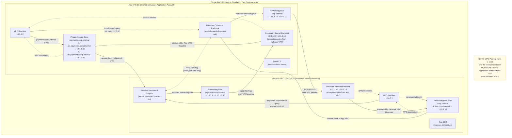

# Route 53 Private Hosted Zone & Resolver Lab
## Simulating Multi-Account DNS in a Single AWS Account

---

## What This Lab Builds

This lab uses **two VPCs in a single AWS account** to simulate the Network Account / Application Account DNS pattern used in multi-account AWS organizations. By the end you will have:

- Two isolated VPCs with no direct routing between them (intentionally — they communicate only through DNS forwarding rules, not data-plane traffic)
- A parent private hosted zone (`corp.internal`) attached to the Network VPC
- A subdomain private hosted zone (`payments.corp.internal`) attached to the App VPC
- Route 53 Resolver **Inbound Endpoints** in each VPC accepting forwarded queries
- Route 53 Resolver **Outbound Endpoints** in each VPC sending forwarded queries
- **Forwarding rules** so each VPC can resolve records owned by the other's hosted zone
- Sample DNS records and EC2 test instances to verify end-to-end resolution

---

## Architecture Diagram



---

## Prerequisites

- AWS CLI v2 installed and configured (`aws configure`)
- An AWS account with permissions for: VPC, Route 53, Route 53 Resolver, EC2, IAM
- Default region set — this lab uses `us-east-1`. Adjust as needed.
- `jq` installed locally for parsing CLI output (optional but recommended)

Set a shell variable for your region throughout this lab:

```bash
export AWS_REGION=us-east-1
```

---

## Step 1 — Create the Network VPC

```bash
# Create Network VPC
NET_VPC_ID=$(aws ec2 create-vpc \
  --cidr-block 10.0.0.0/16 \
  --tag-specifications 'ResourceType=vpc,Tags=[{Key=Name,Value=network-vpc},{Key=Lab,Value=r53-resolver}]' \
  --query 'Vpc.VpcId' --output text)
echo "Network VPC: $NET_VPC_ID"

# Enable DNS hostnames and resolution (required for Route 53 Resolver)
aws ec2 modify-vpc-attribute --vpc-id $NET_VPC_ID --enable-dns-hostnames
aws ec2 modify-vpc-attribute --vpc-id $NET_VPC_ID --enable-dns-support

# Create two subnets in different AZs (required for resolver endpoints)
NET_SUBNET_A=$(aws ec2 create-subnet \
  --vpc-id $NET_VPC_ID \
  --cidr-block 10.0.1.0/24 \
  --availability-zone ${AWS_REGION}a \
  --tag-specifications 'ResourceType=subnet,Tags=[{Key=Name,Value=network-subnet-a}]' \
  --query 'Subnet.SubnetId' --output text)

NET_SUBNET_B=$(aws ec2 create-subnet \
  --vpc-id $NET_VPC_ID \
  --cidr-block 10.0.2.0/24 \
  --availability-zone ${AWS_REGION}b \
  --tag-specifications 'ResourceType=subnet,Tags=[{Key=Name,Value=network-subnet-b}]' \
  --query 'Subnet.SubnetId' --output text)

echo "Network Subnets: $NET_SUBNET_A  $NET_SUBNET_B"
```

---

## Step 2 — Create the App VPC

```bash
# Create App VPC
APP_VPC_ID=$(aws ec2 create-vpc \
  --cidr-block 10.1.0.0/16 \
  --tag-specifications 'ResourceType=vpc,Tags=[{Key=Name,Value=app-vpc},{Key=Lab,Value=r53-resolver}]' \
  --query 'Vpc.VpcId' --output text)
echo "App VPC: $APP_VPC_ID"

aws ec2 modify-vpc-attribute --vpc-id $APP_VPC_ID --enable-dns-hostnames
aws ec2 modify-vpc-attribute --vpc-id $APP_VPC_ID --enable-dns-support

APP_SUBNET_A=$(aws ec2 create-subnet \
  --vpc-id $APP_VPC_ID \
  --cidr-block 10.1.1.0/24 \
  --availability-zone ${AWS_REGION}a \
  --tag-specifications 'ResourceType=subnet,Tags=[{Key=Name,Value=app-subnet-a}]' \
  --query 'Subnet.SubnetId' --output text)

APP_SUBNET_B=$(aws ec2 create-subnet \
  --vpc-id $APP_VPC_ID \
  --cidr-block 10.1.2.0/24 \
  --availability-zone ${AWS_REGION}b \
  --tag-specifications 'ResourceType=subnet,Tags=[{Key=Name,Value=app-subnet-b}]' \
  --query 'Subnet.SubnetId' --output text)

echo "App Subnets: $APP_SUBNET_A  $APP_SUBNET_B"
```

---

## Step 3 — Create VPC Peering (for Resolver Endpoint Connectivity)

Route 53 Resolver Outbound Endpoints forward DNS queries over the network to Inbound Endpoint IPs in the other VPC. The two VPCs need a data-plane path for port 53 traffic. VPC Peering is the simplest option in a single account.

> In a real multi-account setup, Transit Gateway or PrivateLink serves this role. The forwarding mechanism is identical — only the network path differs.

```bash
# Request peering connection
PEERING_ID=$(aws ec2 create-vpc-peering-connection \
  --vpc-id $NET_VPC_ID \
  --peer-vpc-id $APP_VPC_ID \
  --tag-specifications 'ResourceType=vpc-peering-connection,Tags=[{Key=Name,Value=network-to-app-peering}]' \
  --query 'VpcPeeringConnection.VpcPeeringConnectionId' --output text)
echo "Peering ID: $PEERING_ID"

# Accept (same account, can accept immediately)
aws ec2 accept-vpc-peering-connection --vpc-peering-connection-id $PEERING_ID

# Create route tables and add routes for peering
NET_RTB=$(aws ec2 create-route-table --vpc-id $NET_VPC_ID \
  --tag-specifications 'ResourceType=route-table,Tags=[{Key=Name,Value=network-rtb}]' \
  --query 'RouteTable.RouteTableId' --output text)

APP_RTB=$(aws ec2 create-route-table --vpc-id $APP_VPC_ID \
  --tag-specifications 'ResourceType=route-table,Tags=[{Key=Name,Value=app-rtb}]' \
  --query 'RouteTable.RouteTableId' --output text)

# Network VPC: route to App VPC CIDR via peering
aws ec2 create-route --route-table-id $NET_RTB \
  --destination-cidr-block 10.1.0.0/16 \
  --vpc-peering-connection-id $PEERING_ID

# App VPC: route to Network VPC CIDR via peering
aws ec2 create-route --route-table-id $APP_RTB \
  --destination-cidr-block 10.0.0.0/16 \
  --vpc-peering-connection-id $PEERING_ID

# Associate route tables with subnets
aws ec2 associate-route-table --route-table-id $NET_RTB --subnet-id $NET_SUBNET_A
aws ec2 associate-route-table --route-table-id $NET_RTB --subnet-id $NET_SUBNET_B
aws ec2 associate-route-table --route-table-id $APP_RTB --subnet-id $APP_SUBNET_A
aws ec2 associate-route-table --route-table-id $APP_RTB --subnet-id $APP_SUBNET_B
```

---

## Step 4 — Create Security Groups for Resolver Endpoints

Resolver endpoints need a security group that allows inbound UDP and TCP on port 53 from the other VPC's CIDR.

```bash
# Network VPC — security group for its resolver endpoints
NET_SG=$(aws ec2 create-security-group \
  --group-name network-resolver-sg \
  --description "Allow DNS from App VPC" \
  --vpc-id $NET_VPC_ID \
  --query 'GroupId' --output text)

aws ec2 authorize-security-group-ingress --group-id $NET_SG \
  --ip-permissions \
  '[{"IpProtocol":"udp","FromPort":53,"ToPort":53,"IpRanges":[{"CidrIp":"10.1.0.0/16","Description":"App VPC DNS"}]},
    {"IpProtocol":"tcp","FromPort":53,"ToPort":53,"IpRanges":[{"CidrIp":"10.1.0.0/16","Description":"App VPC DNS TCP"}]}]'

echo "Network Resolver SG: $NET_SG"

# App VPC — security group for its resolver endpoints
APP_SG=$(aws ec2 create-security-group \
  --group-name app-resolver-sg \
  --description "Allow DNS from Network VPC" \
  --vpc-id $APP_VPC_ID \
  --query 'GroupId' --output text)

aws ec2 authorize-security-group-ingress --group-id $APP_SG \
  --ip-permissions \
  '[{"IpProtocol":"udp","FromPort":53,"ToPort":53,"IpRanges":[{"CidrIp":"10.0.0.0/16","Description":"Network VPC DNS"}]},
    {"IpProtocol":"tcp","FromPort":53,"ToPort":53,"IpRanges":[{"CidrIp":"10.0.0.0/16","Description":"Network VPC DNS TCP"}]}]'

echo "App Resolver SG: $APP_SG"
```

---

## Step 5 — Create the Private Hosted Zones

### Parent domain in Network VPC

```bash
NET_PHZ_ID=$(aws route53 create-hosted-zone \
  --name corp.internal \
  --caller-reference "net-phz-$(date +%s)" \
  --hosted-zone-config Comment="Network VPC parent domain",PrivateZone=true \
  --vpc VPCRegion=${AWS_REGION},VPCId=${NET_VPC_ID} \
  --query 'HostedZone.Id' --output text | sed 's|/hostedzone/||')
echo "Network PHZ ID: $NET_PHZ_ID"

# Add a sample A record
aws route53 change-resource-record-sets \
  --hosted-zone-id $NET_PHZ_ID \
  --change-batch '{
    "Changes": [{
      "Action": "CREATE",
      "ResourceRecordSet": {
        "Name": "hub.corp.internal",
        "Type": "A",
        "TTL": 300,
        "ResourceRecords": [{"Value": "10.0.1.50"}]
      }
    }]
  }'
```

### Subdomain in App VPC

```bash
APP_PHZ_ID=$(aws route53 create-hosted-zone \
  --name payments.corp.internal \
  --caller-reference "app-phz-$(date +%s)" \
  --hosted-zone-config Comment="App VPC payments subdomain",PrivateZone=true \
  --vpc VPCRegion=${AWS_REGION},VPCId=${APP_VPC_ID} \
  --query 'HostedZone.Id' --output text | sed 's|/hostedzone/||')
echo "App PHZ ID: $APP_PHZ_ID"

# Add sample A records
aws route53 change-resource-record-sets \
  --hosted-zone-id $APP_PHZ_ID \
  --change-batch '{
    "Changes": [
      {
        "Action": "CREATE",
        "ResourceRecordSet": {
          "Name": "api.payments.corp.internal",
          "Type": "A",
          "TTL": 300,
          "ResourceRecords": [{"Value": "10.1.1.50"}]
        }
      },
      {
        "Action": "CREATE",
        "ResourceRecordSet": {
          "Name": "db.payments.corp.internal",
          "Type": "A",
          "TTL": 300,
          "ResourceRecords": [{"Value": "10.1.2.50"}]
        }
      }
    ]
  }'
```

---

## Step 6 — Create Resolver Inbound Endpoints

Inbound Endpoints listen on ENIs in each VPC and accept DNS queries forwarded from the other VPC's Outbound Endpoint.

### Inbound Endpoint in Network VPC

```bash
NET_INBOUND=$(aws route53resolver create-resolver-endpoint \
  --creator-request-id "net-inbound-$(date +%s)" \
  --name network-inbound-endpoint \
  --security-group-ids $NET_SG \
  --direction INBOUND \
  --ip-addresses \
    SubnetId=${NET_SUBNET_A} \
    SubnetId=${NET_SUBNET_B} \
  --tags Key=Name,Value=network-inbound Key=Lab,Value=r53-resolver \
  --query 'ResolverEndpoint.Id' --output text)
echo "Network Inbound Endpoint ID: $NET_INBOUND"

# Wait for it to become OPERATIONAL (takes ~1-2 minutes)
aws route53resolver get-resolver-endpoint \
  --resolver-endpoint-id $NET_INBOUND \
  --query 'ResolverEndpoint.Status'

# Get the assigned ENI IPs (needed later for forwarding rules)
NET_INBOUND_IPS=$(aws route53resolver list-resolver-endpoint-ip-addresses \
  --resolver-endpoint-id $NET_INBOUND \
  --query 'IpAddresses[*].Ip' --output text)
echo "Network Inbound IPs: $NET_INBOUND_IPS"
```

### Inbound Endpoint in App VPC

```bash
APP_INBOUND=$(aws route53resolver create-resolver-endpoint \
  --creator-request-id "app-inbound-$(date +%s)" \
  --name app-inbound-endpoint \
  --security-group-ids $APP_SG \
  --direction INBOUND \
  --ip-addresses \
    SubnetId=${APP_SUBNET_A} \
    SubnetId=${APP_SUBNET_B} \
  --tags Key=Name,Value=app-inbound Key=Lab,Value=r53-resolver \
  --query 'ResolverEndpoint.Id' --output text)
echo "App Inbound Endpoint ID: $APP_INBOUND"

APP_INBOUND_IPS=$(aws route53resolver list-resolver-endpoint-ip-addresses \
  --resolver-endpoint-id $APP_INBOUND \
  --query 'IpAddresses[*].Ip' --output text)
echo "App Inbound IPs: $APP_INBOUND_IPS"
```

> **Wait step:** Endpoints take 1–2 minutes to reach OPERATIONAL status. Check with:
> ```bash
> aws route53resolver get-resolver-endpoint \
>   --resolver-endpoint-id $NET_INBOUND \
>   --query 'ResolverEndpoint.{Status:Status,IpCount:IpAddressCount}'
> ```

---

## Step 7 — Create Resolver Outbound Endpoints

Outbound Endpoints are the source ENIs from which forwarded queries leave each VPC toward the other's Inbound Endpoint.

### Outbound Endpoint in Network VPC

```bash
NET_OUTBOUND=$(aws route53resolver create-resolver-endpoint \
  --creator-request-id "net-outbound-$(date +%s)" \
  --name network-outbound-endpoint \
  --security-group-ids $NET_SG \
  --direction OUTBOUND \
  --ip-addresses \
    SubnetId=${NET_SUBNET_A} \
    SubnetId=${NET_SUBNET_B} \
  --tags Key=Name,Value=network-outbound Key=Lab,Value=r53-resolver \
  --query 'ResolverEndpoint.Id' --output text)
echo "Network Outbound Endpoint ID: $NET_OUTBOUND"
```

### Outbound Endpoint in App VPC

```bash
APP_OUTBOUND=$(aws route53resolver create-resolver-endpoint \
  --creator-request-id "app-outbound-$(date +%s)" \
  --name app-outbound-endpoint \
  --security-group-ids $APP_SG \
  --direction OUTBOUND \
  --ip-addresses \
    SubnetId=${APP_SUBNET_A} \
    SubnetId=${APP_SUBNET_B} \
  --tags Key=Name,Value=app-outbound Key=Lab,Value=r53-resolver \
  --query 'ResolverEndpoint.Id' --output text)
echo "App Outbound Endpoint ID: $APP_OUTBOUND"
```

---

## Step 8 — Create Forwarding Rules

### Rule 1 — Network VPC forwards `payments.corp.internal` → App Inbound Endpoint

Replace `APP_IP_1` and `APP_IP_2` with the actual IPs returned in Step 6. Capture them:

```bash
# Parse IPs from the space-separated output
APP_IP_1=$(echo $APP_INBOUND_IPS | awk '{print $1}')
APP_IP_2=$(echo $APP_INBOUND_IPS | awk '{print $2}')

NET_RULE=$(aws route53resolver create-resolver-rule \
  --creator-request-id "net-rule-$(date +%s)" \
  --name forward-payments-subdomain \
  --rule-type FORWARD \
  --domain-name payments.corp.internal \
  --resolver-endpoint-id $NET_OUTBOUND \
  --target-ips "Ip=${APP_IP_1},Port=53" "Ip=${APP_IP_2},Port=53" \
  --tags Key=Name,Value=forward-payments Key=Lab,Value=r53-resolver \
  --query 'ResolverRule.Id' --output text)
echo "Network Forwarding Rule ID: $NET_RULE"

# Associate the rule with the Network VPC
aws route53resolver associate-resolver-rule \
  --resolver-rule-id $NET_RULE \
  --vpc-id $NET_VPC_ID \
  --name net-vpc-payments-assoc
```

### Rule 2 — App VPC forwards `corp.internal` → Network Inbound Endpoint

```bash
NET_IP_1=$(echo $NET_INBOUND_IPS | awk '{print $1}')
NET_IP_2=$(echo $NET_INBOUND_IPS | awk '{print $2}')

APP_RULE=$(aws route53resolver create-resolver-rule \
  --creator-request-id "app-rule-$(date +%s)" \
  --name forward-parent-domain \
  --rule-type FORWARD \
  --domain-name corp.internal \
  --resolver-endpoint-id $APP_OUTBOUND \
  --target-ips "Ip=${NET_IP_1},Port=53" "Ip=${NET_IP_2},Port=53" \
  --tags Key=Name,Value=forward-corp-internal Key=Lab,Value=r53-resolver \
  --query 'ResolverRule.Id' --output text)
echo "App Forwarding Rule ID: $APP_RULE"

# Associate the rule with the App VPC
aws route53resolver associate-resolver-rule \
  --resolver-rule-id $APP_RULE \
  --vpc-id $APP_VPC_ID \
  --name app-vpc-corp-assoc
```

---

## Step 9 — Launch Test EC2 Instances

You need an EC2 instance in each VPC to run `nslookup` or `dig` and verify resolution. The instances need SSM Agent to avoid requiring a bastion host — use Amazon Linux 2023 which includes SSM Agent by default.

### IAM Role for SSM

```bash
# Create instance role
aws iam create-role \
  --role-name r53-lab-ssm-role \
  --assume-role-policy-document '{
    "Version":"2012-10-17",
    "Statement":[{
      "Effect":"Allow",
      "Principal":{"Service":"ec2.amazonaws.com"},
      "Action":"sts:AssumeRole"
    }]
  }'

aws iam attach-role-policy \
  --role-name r53-lab-ssm-role \
  --policy-arn arn:aws:iam::aws:policy/AmazonSSMManagedInstanceCore

aws iam create-instance-profile \
  --instance-profile-name r53-lab-ssm-profile

aws iam add-role-to-instance-profile \
  --instance-profile-name r53-lab-ssm-profile \
  --role-name r53-lab-ssm-role
```

### SSM VPC Endpoints (required for SSM without internet access)

```bash
# Endpoint security group (allow HTTPS from each VPC)
for VPC_ID in $NET_VPC_ID $APP_VPC_ID; do
  SSM_SG=$(aws ec2 create-security-group \
    --group-name ssm-endpoint-sg \
    --description "SSM endpoint access" \
    --vpc-id $VPC_ID \
    --query 'GroupId' --output text)

  aws ec2 authorize-security-group-ingress --group-id $SSM_SG \
    --protocol tcp --port 443 --cidr 0.0.0.0/0

  for SVC in ssm ssmmessages ec2messages; do
    aws ec2 create-vpc-endpoint \
      --vpc-id $VPC_ID \
      --vpc-endpoint-type Interface \
      --service-name com.amazonaws.${AWS_REGION}.${SVC} \
      --security-group-ids $SSM_SG \
      --subnet-ids $([ "$VPC_ID" == "$NET_VPC_ID" ] && echo $NET_SUBNET_A || echo $APP_SUBNET_A) \
      --private-dns-enabled \
      --tag-specifications "ResourceType=vpc-endpoint,Tags=[{Key=Name,Value=${SVC}-${VPC_ID}}]"
  done
done
```

### Launch EC2 Instances

```bash
# Find latest Amazon Linux 2023 AMI
AMI=$(aws ec2 describe-images \
  --owners amazon \
  --filters 'Name=name,Values=al2023-ami-*-x86_64' \
            'Name=state,Values=available' \
  --query 'sort_by(Images,&CreationDate)[-1].ImageId' \
  --output text)
echo "AMI: $AMI"

# EC2 in Network VPC
NET_EC2=$(aws ec2 run-instances \
  --image-id $AMI \
  --instance-type t3.micro \
  --subnet-id $NET_SUBNET_A \
  --iam-instance-profile Name=r53-lab-ssm-profile \
  --no-associate-public-ip-address \
  --tag-specifications \
    'ResourceType=instance,Tags=[{Key=Name,Value=network-test-ec2},{Key=Lab,Value=r53-resolver}]' \
  --query 'Instances[0].InstanceId' --output text)
echo "Network EC2: $NET_EC2"

# EC2 in App VPC
APP_EC2=$(aws ec2 run-instances \
  --image-id $AMI \
  --instance-type t3.micro \
  --subnet-id $APP_SUBNET_A \
  --iam-instance-profile Name=r53-lab-ssm-profile \
  --no-associate-public-ip-address \
  --tag-specifications \
    'ResourceType=instance,Tags=[{Key=Name,Value=app-test-ec2},{Key=Lab,Value=r53-resolver}]' \
  --query 'Instances[0].InstanceId' --output text)
echo "App EC2: $APP_EC2"
```

---

## Step 10 — Verify DNS Resolution

Wait for instances to reach running state and SSM to become available (~2 minutes), then connect via Session Manager.

```bash
# Open shell on Network VPC EC2
aws ssm start-session --target $NET_EC2
```

Inside the session, run:

```bash
# Should resolve from the Network VPC's own PHZ
nslookup hub.corp.internal
# Expected: 10.0.1.50

# Should be forwarded to App VPC via resolver rule → App PHZ
nslookup api.payments.corp.internal
# Expected: 10.1.1.50

nslookup db.payments.corp.internal
# Expected: 10.1.2.50
```

```bash
# Open shell on App VPC EC2
aws ssm start-session --target $APP_EC2
```

Inside the session, run:

```bash
# Should resolve from App VPC's own PHZ
nslookup api.payments.corp.internal
# Expected: 10.1.1.50

# Should be forwarded to Network VPC via resolver rule → parent PHZ
nslookup hub.corp.internal
# Expected: 10.0.1.50
```

### Expected Resolution Summary

| Query from | Record queried | Resolution path | Expected answer |
|---|---|---|---|
| Network EC2 | `hub.corp.internal` | Local PHZ | `10.0.1.50` |
| Network EC2 | `api.payments.corp.internal` | Forwarding rule → App Inbound → App PHZ | `10.1.1.50` |
| Network EC2 | `db.payments.corp.internal` | Forwarding rule → App Inbound → App PHZ | `10.1.2.50` |
| App EC2 | `api.payments.corp.internal` | Local PHZ | `10.1.1.50` |
| App EC2 | `hub.corp.internal` | Forwarding rule → Network Inbound → Network PHZ | `10.0.1.50` |

---

## How This Maps to a Real Multi-Account Setup

| This lab | Real multi-account |
|---|---|
| Two VPCs in one account | Two AWS accounts (Network Account + App Account) |
| VPC Peering for resolver traffic | Transit Gateway or PrivateLink between accounts |
| Forwarding rule in same account | Forwarding rule shared via AWS RAM to spoke account |
| Cross-VPC route table entry | TGW route table or VPC attachment route |
| Same-account PHZ association | Cross-account PHZ association (two-step authorization) |

The Route 53 Resolver configuration — endpoints, forwarding rules, domain names, target IPs — is **identical** in both this lab and a real multi-account deployment. Only the network path changes.

---

## Troubleshooting

**`nslookup` returns SERVFAIL or times out**

1. Check resolver endpoint status:
   ```bash
   aws route53resolver list-resolver-endpoints \
     --query 'ResolverEndpoints[*].{Name:Name,Status:Status}'
   ```
   Both inbound and outbound endpoints must show `OPERATIONAL`.

2. Verify the forwarding rule is associated with the correct VPC:
   ```bash
   aws route53resolver list-resolver-rule-associations \
     --query 'ResolverRuleAssociations[*].{Rule:ResolverRuleId,VPC:VPCId,Status:Status}'
   ```

3. Check that the security group on the Inbound Endpoint allows UDP/TCP 53 from the peered VPC CIDR.

4. Confirm the peering route table entries exist in both VPCs:
   ```bash
   aws ec2 describe-route-tables \
     --filters Name=vpc-id,Values=$NET_VPC_ID \
     --query 'RouteTables[*].Routes[?DestinationCidrBlock==`10.1.0.0/16`]'
   ```

**PHZ records not resolving locally**

Verify the PHZ is associated with the correct VPC:
```bash
aws route53 list-vpc-association-authorizations --hosted-zone-id $APP_PHZ_ID
aws route53 get-hosted-zone --id $APP_PHZ_ID \
  --query 'VPCs'
```

**SSM session fails to connect**

Ensure the SSM, SSMMessages, and EC2Messages VPC Interface Endpoints exist and have private DNS enabled. The instance profile must have `AmazonSSMManagedInstanceCore` attached.

---

## Cleanup

Remove all resources in reverse order to avoid dependency errors:

```bash
# Terminate EC2 instances
aws ec2 terminate-instances --instance-ids $NET_EC2 $APP_EC2

# Disassociate and delete resolver rules
aws route53resolver disassociate-resolver-rule --resolver-rule-id $NET_RULE --vpc-id $NET_VPC_ID
aws route53resolver disassociate-resolver-rule --resolver-rule-id $APP_RULE --vpc-id $APP_VPC_ID
aws route53resolver delete-resolver-rule --resolver-rule-id $NET_RULE
aws route53resolver delete-resolver-rule --resolver-rule-id $APP_RULE

# Delete resolver endpoints
aws route53resolver delete-resolver-endpoint --resolver-endpoint-id $NET_INBOUND
aws route53resolver delete-resolver-endpoint --resolver-endpoint-id $NET_OUTBOUND
aws route53resolver delete-resolver-endpoint --resolver-endpoint-id $APP_INBOUND
aws route53resolver delete-resolver-endpoint --resolver-endpoint-id $APP_OUTBOUND

# Delete hosted zones (remove records first)
aws route53 change-resource-record-sets --hosted-zone-id $NET_PHZ_ID \
  --change-batch '{"Changes":[{"Action":"DELETE","ResourceRecordSet":{"Name":"hub.corp.internal","Type":"A","TTL":300,"ResourceRecords":[{"Value":"10.0.1.50"}]}}]}'
aws route53 change-resource-record-sets --hosted-zone-id $APP_PHZ_ID \
  --change-batch '{"Changes":[{"Action":"DELETE","ResourceRecordSet":{"Name":"api.payments.corp.internal","Type":"A","TTL":300,"ResourceRecords":[{"Value":"10.1.1.50"}]}},{"Action":"DELETE","ResourceRecordSet":{"Name":"db.payments.corp.internal","Type":"A","TTL":300,"ResourceRecords":[{"Value":"10.1.2.50"}]}}]}'
aws route53 delete-hosted-zone --id $NET_PHZ_ID
aws route53 delete-hosted-zone --id $APP_PHZ_ID

# Delete VPC peering and routing
aws ec2 delete-vpc-peering-connection --vpc-peering-connection-id $PEERING_ID

# Delete VPCs (subnets, route tables, SGs, endpoints are deleted with the VPC)
aws ec2 delete-vpc --vpc-id $NET_VPC_ID
aws ec2 delete-vpc --vpc-id $APP_VPC_ID

# Delete IAM resources
aws iam remove-role-from-instance-profile \
  --instance-profile-name r53-lab-ssm-profile --role-name r53-lab-ssm-role
aws iam delete-instance-profile --instance-profile-name r53-lab-ssm-profile
aws iam detach-role-policy --role-name r53-lab-ssm-role \
  --policy-arn arn:aws:iam::aws:policy/AmazonSSMManagedInstanceCore
aws iam delete-role --role-name r53-lab-ssm-role
```

---

## References

- [AWS Docs — Route 53 Resolver](https://docs.aws.amazon.com/Route53/latest/DeveloperGuide/resolver.html)
- [AWS Docs — Resolver Inbound and Outbound Endpoints](https://docs.aws.amazon.com/Route53/latest/DeveloperGuide/resolver-forwarding-inbound-queries.html)
- [AWS Docs — Managing Forwarding Rules](https://docs.aws.amazon.com/Route53/latest/DeveloperGuide/resolver-rules-managing.html)
- [AWS Docs — Private Hosted Zones](https://docs.aws.amazon.com/Route53/latest/DeveloperGuide/hosted-zones-private.html)
- [AWS Docs — Cross-Account PHZ Association](https://docs.aws.amazon.com/Route53/latest/DeveloperGuide/hosted-zone-private-associate-vpcs-different-accounts.html)

---

*Last updated: 2026-06-29*
